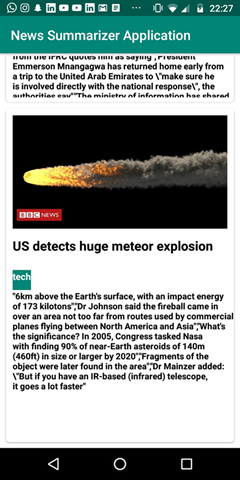
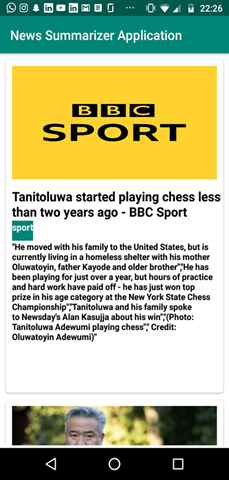

# TextSummarizer

To run the files 

1) Run Classification_Algorithm (it will create the model.pkl and vect.pkl files for you which is the data storing information regarding classifiction)
2) Enter the URL in the News_Article_Summarization and run the code below. (It will related and classify along with a summarized output)
3) you can also gets a richer feel by viewing our android application using the basic features like cardview and json api extraction from the News APIs

Technologies/Concepts used:
Random Forest for Classification
TextRank algorithm(extension of a page rank algorithm)
.pkl files to store the classification information
textblob to dive into commonly used nltk information
